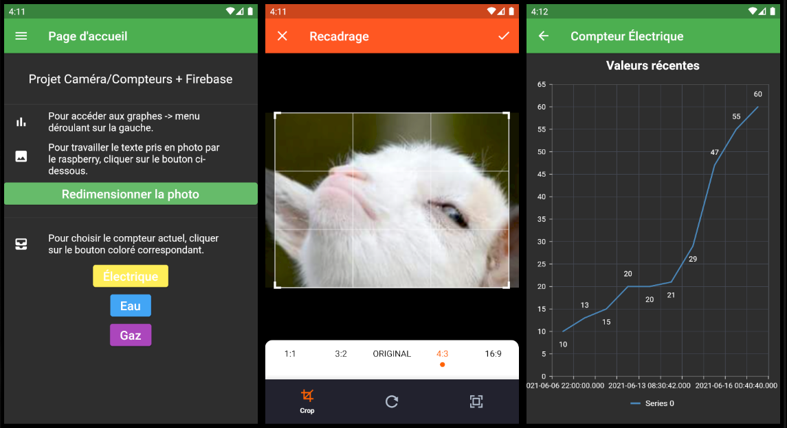

# Flutter project

Mobile app made for a school project involving data from the web and charts visualizations, the backend is Firebase, and the data are used elsewhere by a Raspberry pi.

External libraries used : firebase_core, firebase_storage, cloud_firestore, syncfusion_flutter_charts, image_picker, image_cropper

## Features

- Selection of the meter (the one currently in front of the Raspberry pi) as to notify where to send the data on Firebase

- A cropper tool to retrieve a picture stored in Firebase, crop/resize it, and resend it to Firebase

- Charts updating in real time with key-value pairs of DateTime-Integer from data stored in Firebase

    

## To do
---
- ~~Pages / Navigator and basic styling~~

- ~~Receive Firebase data~~

- ~~Send data to Firebase~~

- ~~A better understanding of widget nesting hierarchy as to not break my layouts when trying things~~

- ~~Use data from Firebase to populate the charts in real time without any refresh of the whole page~~

- ~~Find a way to select 4 (X,Y) coordinates in a MouseRegion to crop pictures and send them to Firebase for the Rasp~~

- ~~Read docs to replace the deprecated widgets~~

